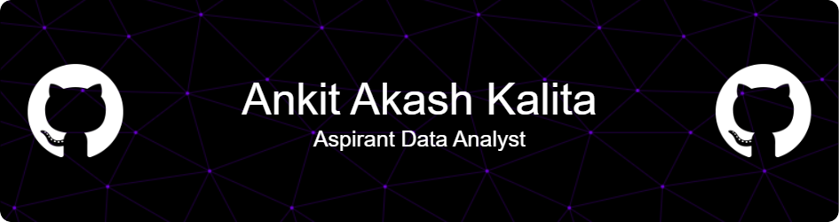

# Hello World! I'm Ankit Akash Kalita, an Aspiring Data Analyst 🧑‍💻

I'm currently building my portfolio by learning and working with:
- **Spreadsheet software** (Microsoft Excel, Google Sheets)
- **Databases** (SQLite, PostgreSQL)
- **Data Visualization tools** (Power BI, Tableau)
- **Programming languages** (Python, R)

I enjoy working on real-world data projects and exploring ways to solve business problems by transforming raw data into clear, actionable insights. Whether it’s cleaning messy datasets or crafting interactive dashboards, I’m always looking to learn more and grow my data analytics skills.

# 💻 Tech Stack:
           

# 📊 GitHub Stats:
 

# 📈 Contributions:
<picture>
  <source media="(prefers-color-scheme: dark)" srcset="https://raw.githubusercontent.com/ankito090/ankito090/output/github-snake-dark.svg" />
  <source media="(prefers-color-scheme: light)" srcset="https://raw.githubusercontent.com/ankito090/ankito090/output/github-snake.svg" />
  
</picture>
